# Raid Over Moscow II

**A 2.5D fan remake of the 1984 Commodore 64 classic _Raid Over Moscow_, playable in the browser.**

▶ **Play it:** https://robertorenz.github.io/RaidoverMoscow2/

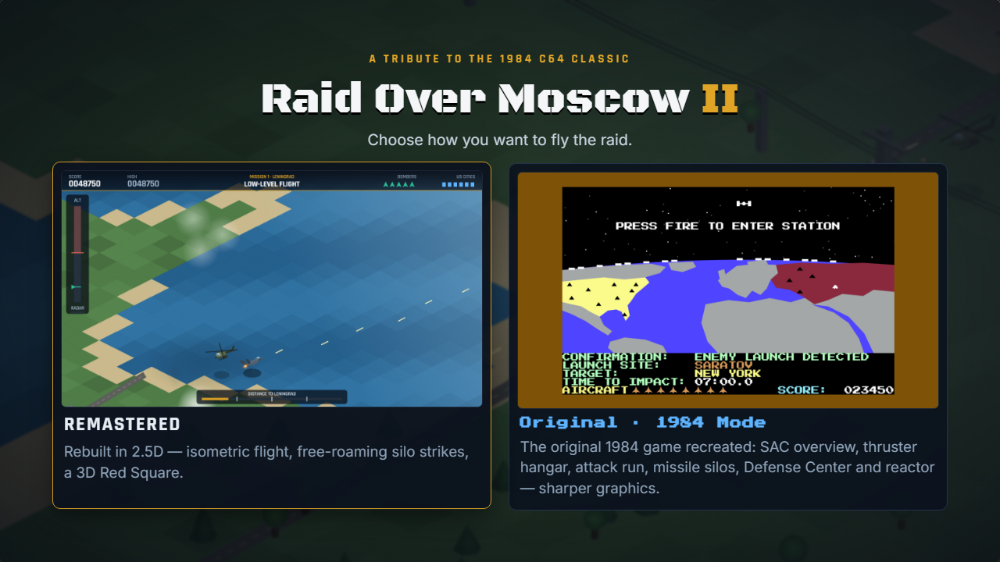

**Two ways to play**, chosen from the start menu:

* **Remastered** — every stage redesigned in 2.5D.
* **Original · 1984 Mode** — the original levels and side-on gameplay recreated as faithfully as possible,
  with C64-style colours and border but sharper, higher-resolution graphics.

In the Remastered mode, all of the original's stages are rebuilt with an isometric / perspective 2.5D renderer (shaded low-poly
geometry, real shadows, altitude cues) while keeping the original's controls and flow: launch from the
orbiting station, fly low across Soviet territory, take out the launch sites, then storm Moscow on foot.

No build step, no dependencies — plain JavaScript and Canvas 2D. Open `index.html` and play.

---

## The stages

### 1 · Hangar Launch
Throttle up, rotate at speed and thread the bomber through the station's bay door while the blast door
cycles. Touch a wall, the ceiling or the door and the bomber is lost. Every new bomber must launch from
here — just like the original.

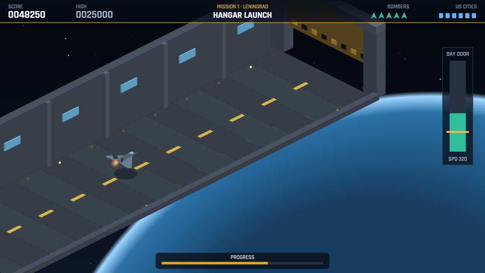

### 2 · Low-Level Flight
The diagonal-scrolling run to the target city. Stay **below the red radar floor**: climb too long and the
radar locks on, SAM sites start launching and MiG interceptors scramble. Fly too low and you're among the
trees, power lines and tower blocks. Strafe tanks, flak guns, SAM sites, patrol boats and helicopters, or drop
bombs on ground targets. Checkpoints mean a lost bomber resumes part way along.

| Leningrad — Baltic coast | Minsk — forest |
|---|---|
| 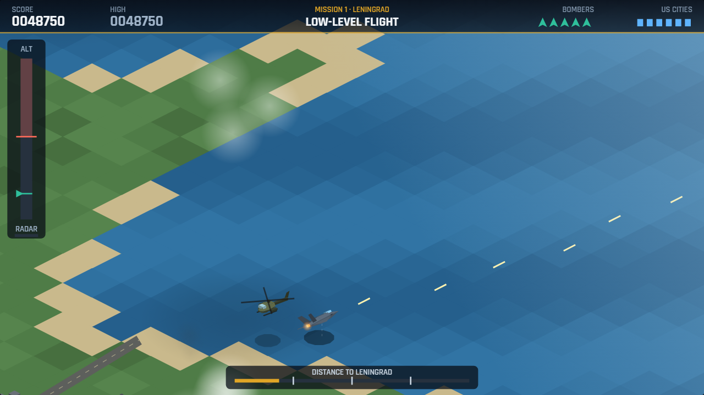 | 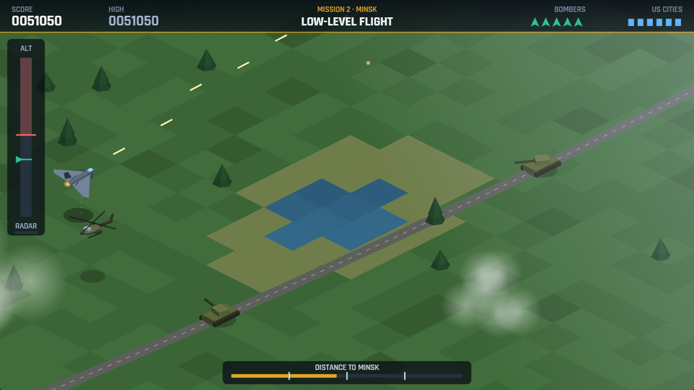 |
| **Kiev — Dnieper farmland** | **Saratov — Volga steppe** |
| 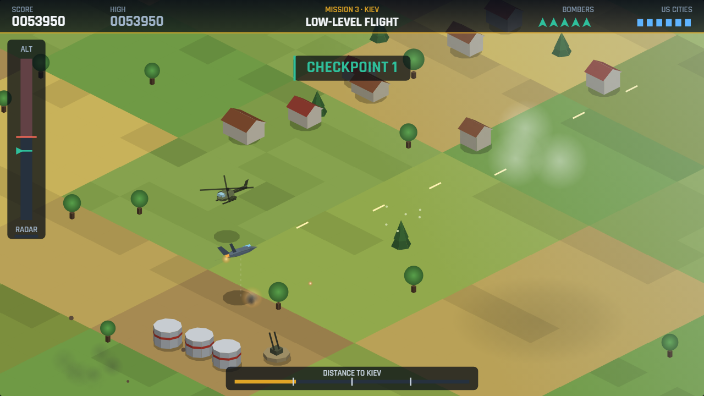 | 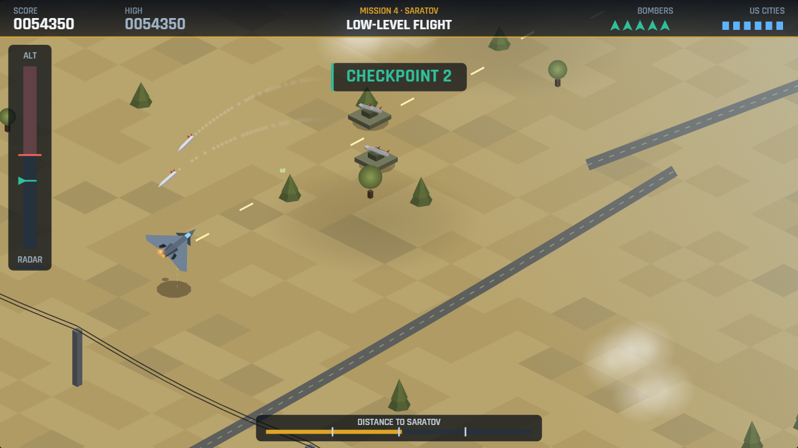 |
| **Moscow — winter** | |
| 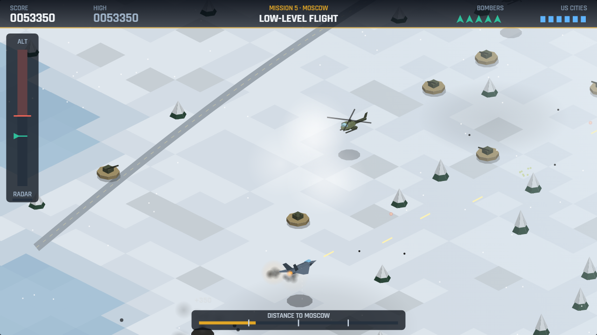 | |

### 3 · Launch Site Strike
Free-roaming attack on the missile base. The **Launch Control Center**'s roof hatches are only vulnerable
while they're open. Meanwhile ICBMs rise out of their silos — shoot each one before it clears the silo or
an American city is lost. AA guns, SAMs and tanks defend the base. A gunsight shows where your rounds land.

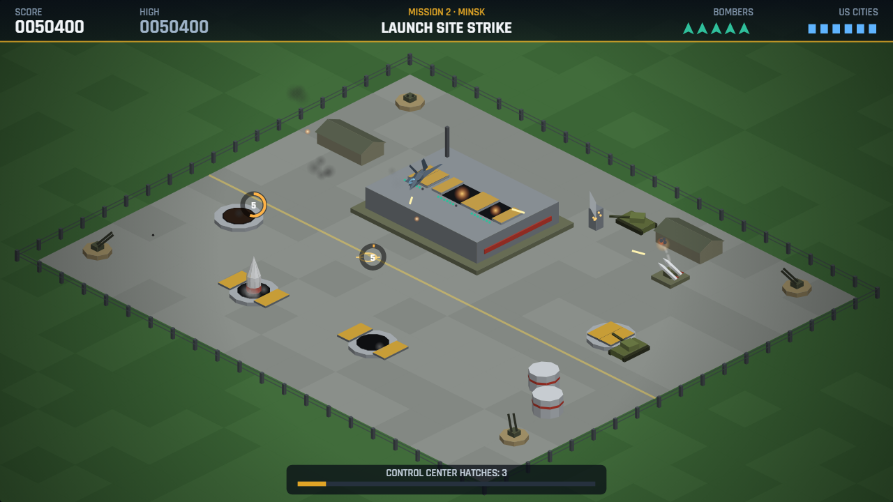

### 4 · Red Square Assault
Moscow at night. Move along the square, set rocket range with ↑/↓ and lob bazooka rounds into the five
armoured bunker doors of the Kremlin Defense Center while troops pour out and tanks roll across the square.

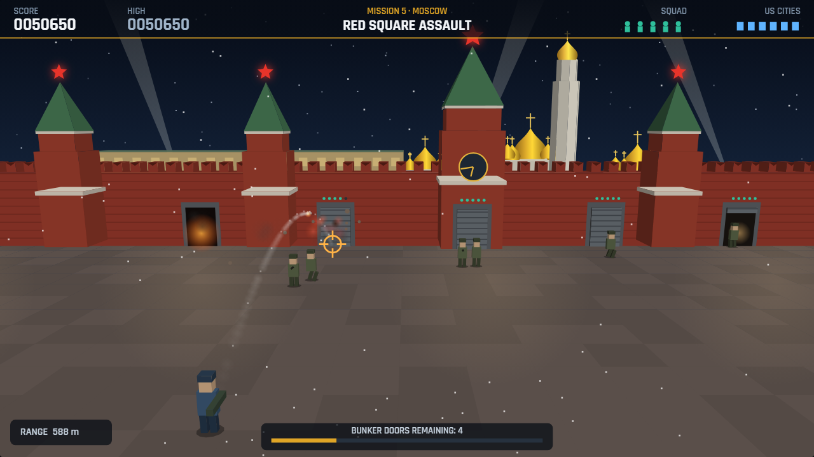

### 5 · Reactor Room
The finale. A defence robot hurls discs at you; throw your own back. Its shield reflects straight throws,
so move while throwing to **bank discs off the walls**. Destroy the robot, then the reactor core — and get out.

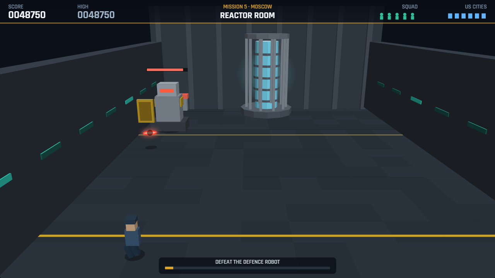

---

## Original · 1984 Mode

A recreation of the original C64 game, rebuilt from the 1984 manual and the C64 screens: the same
sequences, controls, colours and HUD read-outs, with sharper higher-resolution sprites.

| | |
|---|---|
| **Title** — F1 Beginner · F3 Advanced · F5 Suicidal | **I · SAC Headquarters** — enemy launch detected, missiles arc toward a U.S. city |
| 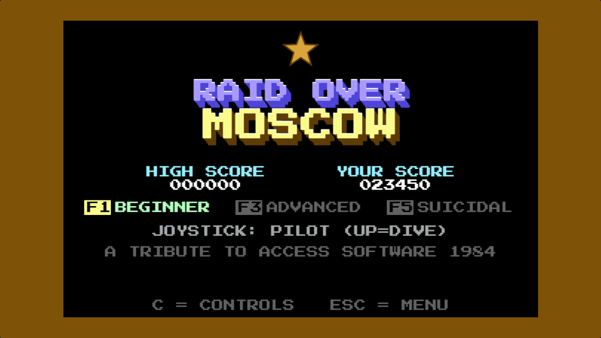 | 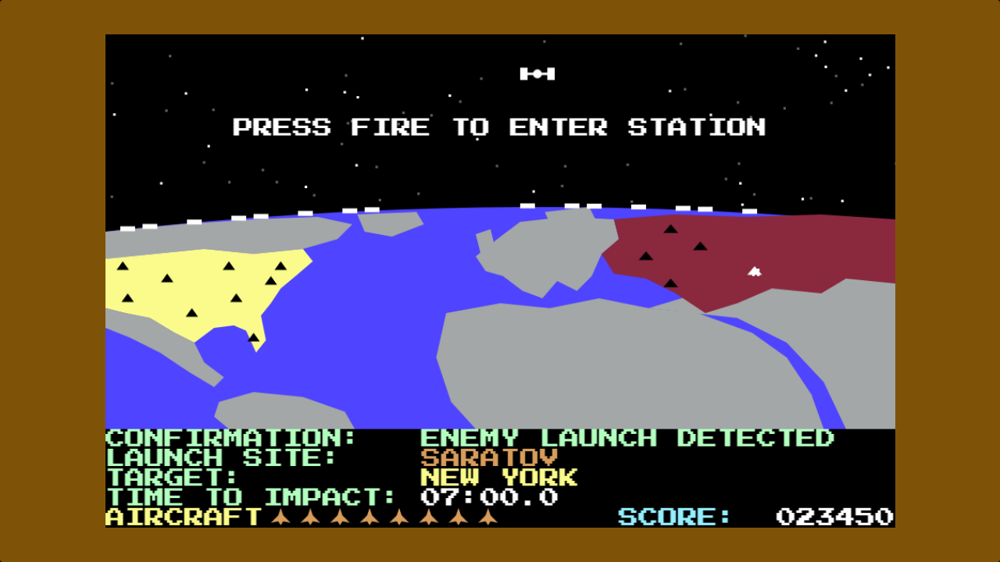 |
| **II · Hangar** — rotate, main engine, vertical thruster against gravity, no brakes; F7 opens the doors briefly | **III · Attack run** — fly low under the radar; heat seekers come from behind |
| 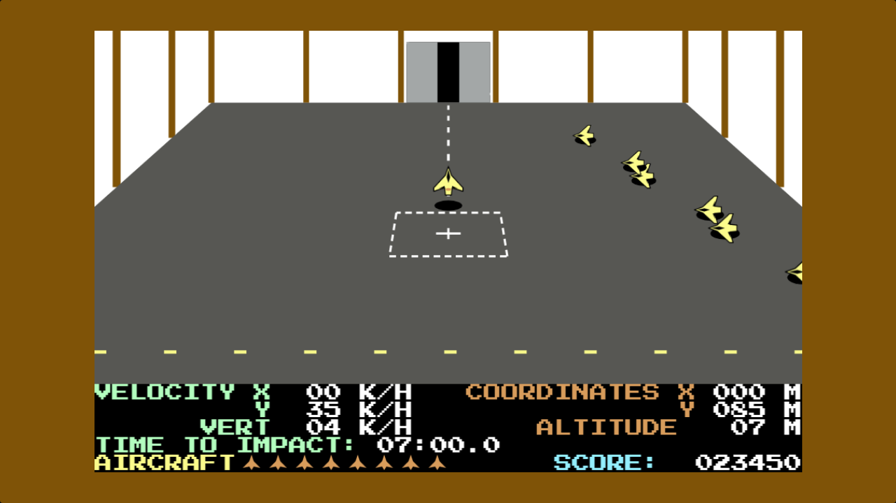 | 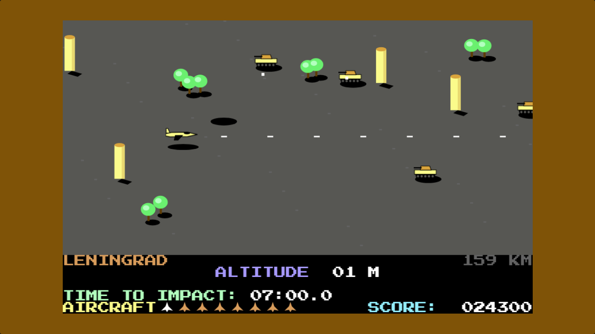 |
| **IV · Missile silos** — fire through a silo's window; your plane turns **blue** when lined up | **V · Defense Center** — mortar elevation from the trench; find the one door that turns white |
| 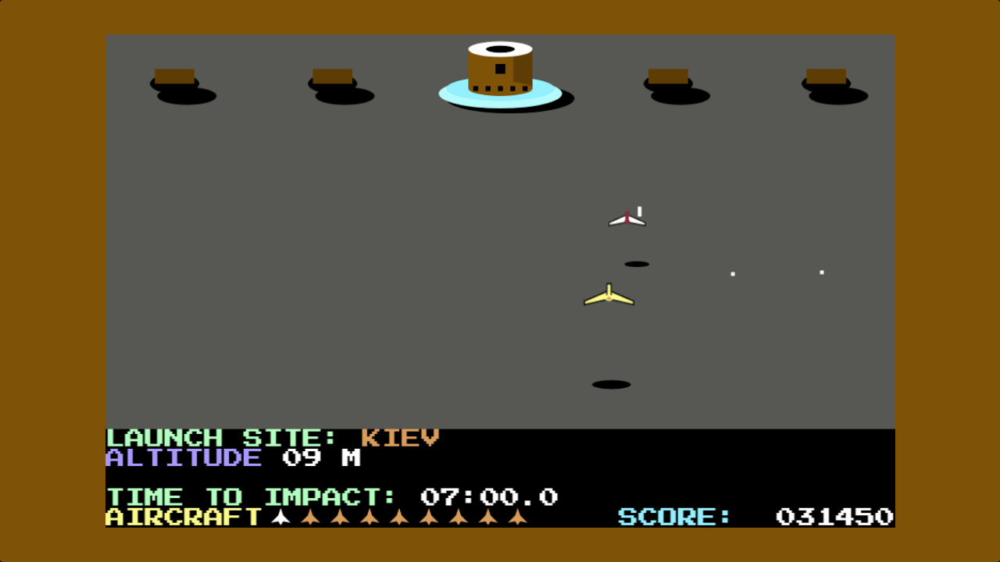 | 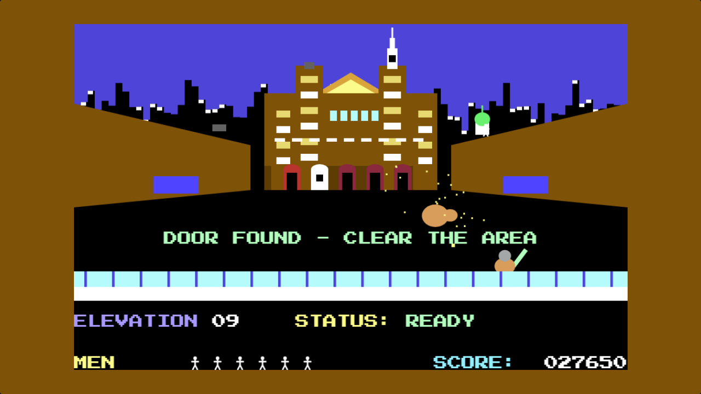 |
| **VI · Reactor room** — bounce discs off the back wall (laser dot) to hit robots from behind | **VII · The final chapter** — AP/UPI report |
| 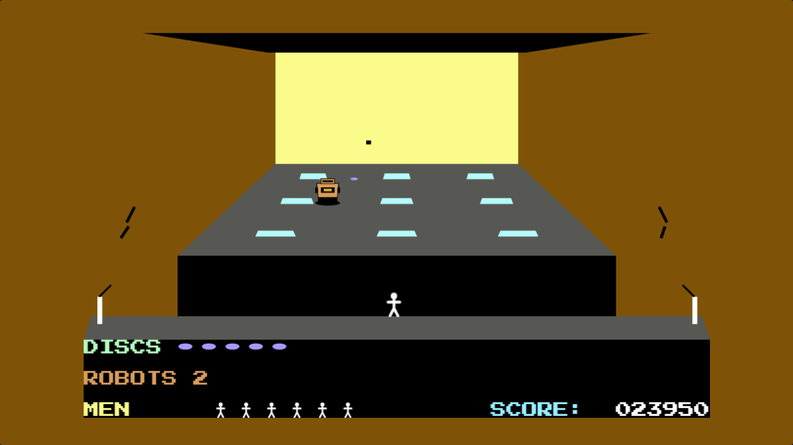 | 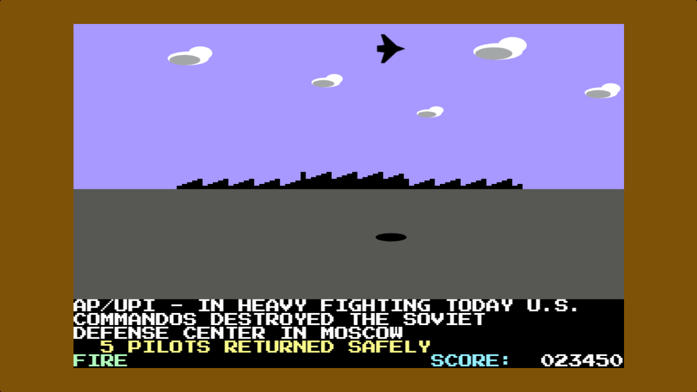 |

**How it plays (as in the original):**

* **SAC HQ:** a launch is detected from Leningrad, Minsk, Kiev or Saratov with a TIME TO IMPACT countdown.
  Press fire to enter the space station.
* **Hangar:** LEFT/RIGHT rotate, UP fires the main engine, FIRE the vertical thruster; land too hard and the
  craft is lost. Press **F7** (or X) once airborne to open the doors — they close again quickly.
* Back on the overview, steer the flashing aircraft to the launch site — or fly back to the station and press
  fire to take more planes out (they wait outside and replace a lost plane at the start of the attack run).
* **Attack run / silos:** forward = dive, back = climb (switch to Arcade controls with **C** on the title).
  The four launch silos each award an extra plane; the centre control silo stops the attack.
* If the countdown runs out, a U.S. city is hit and the site launches again. Three hits and the game is over.
* **Moscow:** the Defense Center needs the right door found and all soldiers and tanks cleared; in the reactor,
  robots (2/4/5 by level) need four hits each from behind. Catch returning discs; run out and you must fight
  your way back in. The last robot leaves the reactor going critical — beat the ETCM timer to escape.

---

## Campaign (Remastered)

| Mission | City | Terrain | Stages |
|---|---|---|---|
| 1 | Leningrad | Baltic coast | Hangar → Flight → Launch site |
| 2 | Minsk | Forest | Hangar → Flight → Launch site |
| 3 | Kiev | Dnieper farmland | Hangar → Flight → Launch site |
| 4 | Saratov | Volga steppe | Hangar → Flight → Launch site |
| 5 | Moscow | Winter | Hangar → Flight → Red Square → Reactor |

* **Bombers** are your lives (squadron size depends on difficulty; a bonus bomber every 40,000 points).
  On foot in Moscow they become your squad.
* **US cities** — six of them. Every ICBM that escapes destroys one. Lose them all and the game is over.
* **Difficulty:** Cadet / Pilot / Ace changes squadron size, enemy fire rate and target armour.
* **Stage Select** lets you practise any stage of any mission.

## Controls

| Action | Keyboard | Gamepad |
|---|---|---|
| Steer / move | ← → or A D | Stick / D-pad |
| Climb / dive · set range | ↑ ↓ or W S | Stick / D-pad |
| Fire · throttle · throw | Space or J | A / RT |
| Bomb (flight) | X or Shift | B / LT |
| Pause | P or Esc | Start |
| Mute | M | |

Touch controls appear automatically on phones and tablets.

## Running locally

```bash
git clone https://github.com/robertorenz/RaidoverMoscow2.git
cd RaidoverMoscow2
# just open index.html, or serve the folder:
python -m http.server 8000
```

### Developer tools

* `node tools/simulate.js [difficulty 0-2] [god 0/1] [mission 0-4] [phase]` — plays the whole campaign
  headlessly on autopilot against a mock canvas to check stage flow and catch runtime errors.
* `node tools/simulate.js classic [level 0-2] [god 0/1] [start]` — the same for the 1984 mode.
* `index.html?shot=<hangar|flight|silo|kremlin|reactor>&m=<0-4>&t=<seconds>` — jumps straight into a stage
  on autopilot (used to capture the screenshots above with headless Chrome).
* `index.html?classic=<title|sac|nav|hangar|run|silo|center|reactor|end>&m=<0-3>&t=<seconds>` — same for the 1984 mode.

## Project layout

```
index.html            page shell and modal UI
css/style.css         UI styling
js/util.js            RNG, noise, colour helpers, storage, keyboard/gamepad/touch input
js/render3d.js        2.5D renderer: isometric + perspective cameras, shaded boxes, prisms, cones, meshes
js/models.js          low-poly models (bomber, MiG, helicopter, tank, ICBM, soldiers, robot…)
js/fx.js              explosions, smoke, debris, floating score text
js/audio.js           procedural WebAudio sound effects and an original chiptune
js/stages/*.js        hangar, flight, silo, kremlin, reactor
js/classic.js         the 1984 mode: all seven original sequences, C64-style renderer and sprites
js/game.js            start menu, campaign flow, HUD, modals, main loop
tools/simulate.js     headless campaign simulator
```

## Credits

_Raid Over Moscow_ was created by Bruce Carver and published by Access Software in 1984. This is an
unofficial, non-commercial fan tribute; it contains no original code, graphics or music from the 1984 game.
All code, artwork (procedural geometry) and music here are original. The game's name and concept belong to
their respective owners.

Code is released under the [MIT License](LICENSE).
